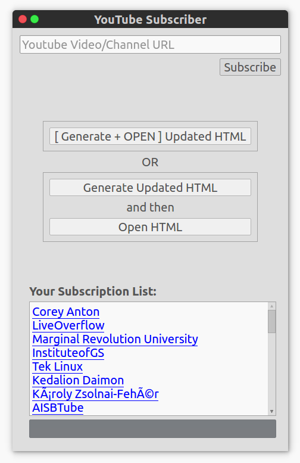

# Youtube Subscriber
Downloads feed from youtube channel and generates a simple html/css page to embed/display thumbnail/video link. As is should only work on linux.

# Setup
* Make sure you have:
	* Qt installed (qt 4), ex: `sudo apt install libqt4-dev`
	* libCurl installed, ex: `sudo apt install libcurl4-gnutls-dev`

* Clone and `cd` into this folder and execute this commands in terminal:
	* `qmake ytube_gui.pro`
	* `make`

Note: ignore the compiler warnings, they will not cause any failures

# Run
* Either
	* go into directory in terminal and `./ytube` or,
	* go to the directory in gui and double click the program

It should look like this image:

# Use
Hopefully is obvious.

# About
As is. Made for learning and personal use.
